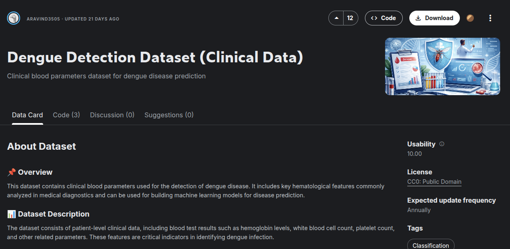
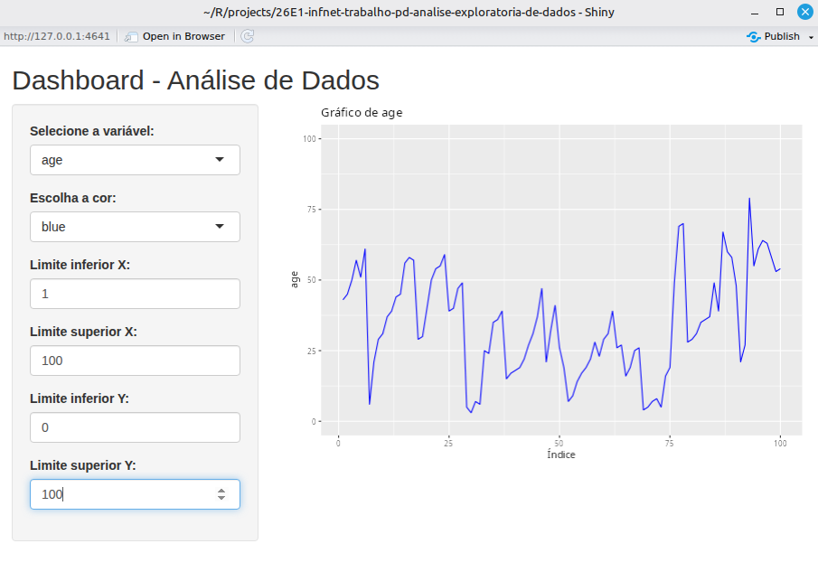

# Escolha da Base de Dados

A base escolhida foi o dataset de Detecção de Dengue (dados clinicos) - Disponível no kaggle: <https://www.kaggle.com/datasets/aravind3505/dengue-detection-dataset-clinical-data>




Motivo da escolha: Possui variáveis numéricas, dados faltantes, permite análise entre variáveis.

Resultados esperados: Identificar relações entre variáveis, analisar distribuição dos dados.

# Pacotes

```{r}
library(summarytools)
library(tidyverse)
library(GGally)
library(mice)
library(ggpubr)
library(shiny)
```

# Carregamento da Base de Dados

```{r}
dados <- read.csv("data/dataset.csv")
#View(dados)
```

```{r}
summary(dados)
```

```{r}
descr(dados)
```

```{r}
analyze_categorical <- function(column, label){
  ggplot(data.frame(column), aes(x=column)) +
    geom_bar(fill="lightblue") +
    labs(
      title=paste("Distribuição de", label),
      x=label,
      y="Frequência"
    ) +
    theme_minimal()
}

analyze_numerical <- function(column, columnLabel){

  Q0 <- min(column, na.rm = TRUE)
  Q1 <- as.numeric(quantile(column, 0.25, na.rm = TRUE))
  Q2 <- as.numeric(quantile(column, 0.50, na.rm = TRUE))
  Q3 <- as.numeric(quantile(column, 0.75, na.rm = TRUE))
  Q4 <- as.numeric(quantile(column, 1.00, na.rm = TRUE))

  IQR_val <- IQR(column, na.rm = TRUE)
  
  mean_val <- mean(column, na.rm = TRUE)
  sd_val <- sd(column, na.rm = TRUE)
  
  # binwidth automático (Freedman-Diaconis)
  n <- length(column)
  binwidth <- 2 * IQR_val / (n^(1/3))

  LI <- Q1 - 1.5 * IQR_val
  LS <- Q3 + 1.5 * IQR_val
  
  cat("Média:",mean_val,"\n")
  cat("Mediana:",Q2,"\n")
  cat("Desvio padrão:",sd_val,"\n")
  cat("Q1:",Q1,"\n")
  cat("Q3:",Q3,"\n")
  cat("IQR:",IQR_val,"\n")

  # Boxplot
  box <- ggplot(data.frame(column), aes(x = "", y = column)) +
    geom_boxplot(fill = "lightblue") +
    geom_hline(yintercept = LI, color = "red", linetype = "dashed") +
    geom_hline(yintercept = LS, color = "blue", linetype = "dashed") +
    geom_hline(yintercept = Q0, color = "orange", linetype = "dashed") +
    geom_hline(yintercept = Q4, color = "orange", linetype = "dashed") +

    annotate("text", x = 1.2, y = Q0, label = "(0%)") +
    annotate("text", x = 1.2, y = Q1, label = paste("Q1 =", Q1)) +
    annotate("text", x = 1.2, y = Q2, label = paste("Q2 =", Q2)) +
    annotate("text", x = 1.2, y = Q3, label = paste("Q3 =", Q3)) +
    annotate("text", x = 1.2, y = Q4, label = "(100%)") +

    annotate("text", x = 1.2, y = LI, label = paste("Limite Inf:", round(LI,2))) +
    annotate("text", x = 1.2, y = LS, label = paste("Limite Sup:", round(LS,2))) +

    labs(title = paste("Boxplot -", columnLabel),
         y = columnLabel,
         x = "")+
    scale_y_continuous(labels = scales::comma)

  # Histograma
  hist <- ggplot(data.frame(column), aes(x = column)) +
    geom_histogram(binwidth = binwidth,
                   aes(y=..density..),
                   fill = "lightblue",
                   color = "black") +
    geom_density(color="darkblue", size=1) +
    geom_vline(xintercept=mean_val,
               color="red",
               linetype="dashed") +
    geom_vline(xintercept=Q2,
               color="green",
               linetype="dashed") +
    labs(title = paste("Histograma -", columnLabel),
         x = columnLabel,
         y = "Frequência")+
    scale_x_continuous(labels = scales::comma)
  
  qqplot <- ggqqplot(column)
  
  shapiro_test <- shapiro.test(column)

  print(box)
  print(hist)
  print(qqplot)
  print(shapiro_test)

}
```

## Análise de Colunas com Dados Nullos

As colunas com dados nullos foram poucas:

```         
wbc_count: 24
```

```         
platelet_count: 16
```

```         
platelet_distribution_width: 19
```

```{r}
colSums(is.na(dados))
```

## Completude de dados

Os dados estão em sua maioria preenchidos a nao ser pelos poucos dados faltantes das colunas acima.

Na minha visão, a completude impacta diretamente a análise exploratória, pois a presença de dados faltantes reduz a quantidade de informações disponíveis e pode comprometer os resultados.

Durante a análise, percebo que valores ausentes podem distorcer medidas estatísticas, dificultar a identificação de padrões e influenciar a interpretação dos dados.

```         
platelet_count: 98%
```

```         
platelet_distribution_width: 98%
```

```         
wbc_count: 97%
```

```         
age: 100%
```

```         
hemoglobin_g_dl: 100% 
```

```         
differential_count: 100%
```

```         
dengue_label: 100%
```

```         
gender: 100%
```

```         
rbc_count: 100%
```

```{r}
colMeans(!is.na(dados))
```

## Análise da Variável Age

A variável age apresenta alguns outliers acima do limite superior, incluindo um valor próximo de 120 anos. Apesar disso, média e mediana são próximas, indicando que os dados não são muito assimétricos.

```{r}
analyze_numerical(dados$age, "Age")
```

## Análise da Variável Hemoglobin Level

A variável apresenta outliers acima do limite superior, com valores próximos de 25. Mesmo assim, média e mediana são próximas, indicando baixa assimetria.

```{r}
analyze_numerical(dados$hemoglobin_g_dl, "Hemoglobin Level")
```

## Análise da Variável White Blood Cell Count

A variável apresenta outliers e dados faltantes. A diferença entre média e mediana indica leve assimetria, e a distribuição não parece normal.

```{r}
analyze_numerical(dados$wbc_count, "White Blood Cell Count")
```

## Análise da Variável Platelet Count

A variável apresenta outliers e dados faltantes. A diferença entre média e mediana indica assimetria nos dados.

```{r}
analyze_numerical(dados$platelet_count, "Platelet Count")
```

## Análise da Variável Variation in Platelet

A variável apresenta alguns outliers e dados faltantes, mas média e mediana próximas indicam baixa assimetria.

```{r}
analyze_numerical(dados$platelet_distribution_width, "Variation in Platelet")
```

## Análise da Variável Dengue

A variável mostra a distribuição dos casos com e sem dengue.

```{r}
analyze_categorical(dados$dengue_label, "Target Variable")
```

## Análise da Variável Gender

A variável apresenta a distribuição de gênero na base, podendo indicar possível desbalanceamento.

```{r}
analyze_categorical(dados$gender, "Gender")
```

## Análise da Variável Differential Count

A variável apresenta a distribuição das categorias relacionadas à contagem diferencial. A análise permite observar a frequência de cada grupo e identificar possíveis desbalanceamentos.

```{r}
dados$differential_count = as.factor(dados$differential_count)
analyze_categorical(dados$differential_count, "Diff White Blood Cell Count")
```

## Análise da Variável Red Blood Cell Count

A variável apresenta a distribuição das categorias relacionadas à contagem de glóbulos vermelhos. É possível observar a proporção entre os grupos e verificar possíveis diferenças entre eles.

```{r}
dados$rbc_count = as.factor(dados$rbc_count)
analyze_categorical(dados$rbc_count, "Red Blood Cell Count")
```

# Remoção de colunas categóricas

```{r}
dados <- dados[, sapply(dados, is.numeric)]
```

# Tratamento de Valores Nullos

Para tratar os dados faltantes, foi utilizada a técnica de imputação por meio do pacote MICE. O método utilizado foi o Predictive Mean Matching (PMM), que estima valores ausentes com base em valores observados semelhantes, preservando a distribuição dos dados. Foram realizadas 5 imputações (m=5). O parâmetro seed foi utilizado para garantir a reprodutibilidade dos resultados.

```{r}
dados = complete(mice(dados, m=5, method="pmm", seed=123))
```

Verificamos novamente se existem valores nullos

```{r}
colSums(is.na(dados))
```

# Análise de pares

```{r}
ggpairs(
  dados,
  
  lower = list(
    continuous = wrap("points") +
      scale_x_continuous(labels = scales::comma) +
      scale_y_continuous(labels = scales::comma)
  ),
  
  diag = list(
    continuous = wrap("densityDiag") +
      scale_x_continuous(labels = scales::comma)
  ),
  
  upper = list(
    continuous = wrap("cor", size = 4)
  )
)+ theme(axis.text = element_text())
```

A partir da análise visual da matriz de espalhamento as maiores correlações foram encontradas entre platelet_count e wbc_count, seguidas pelas relações com dengue_label e platelet_distribution_width, platelet_count e dengue_label, e platelet_count e platelet_distribution_width. As demais variáveis apresentam baixa correlação.\
\
1. platelet_count × wbc_count → corr ≈ 0.749\
2. platelet_distribution_width × dengue_label → corr ≈ -0.651\
3. platelet_count × dengue_label → corr ≈ -0.577\
4. platelet_count × platelet_distribution_width → corr ≈ 0.456

# Resultado da Análise

## Distribuições normais

Com base na análise, observei que as variáveis age e hemoglobin_g_dl apresentam comportamento mais próximo de uma distribuição normal, com menor assimetria. Por outro lado, as variáveis wbc_count, platelet_count e platelet_distribution_width apresentam comportamento semelhante, com assimetria e presença de valores extremos, afastando-se da normalidade.

## Histogramas

A partir da análise dos histogramas, observa-se que as variáveis age e hemoglobin_g_dl apresentam distribuição mais próxima da simétrica, com concentração de valores centrais e baixa assimetria. Por outro lado, as variáveis wbc_count, platelet_count e platelet_distribution_width apresentam comportamento semelhante, com assimetria à direita, indicando maior concentração de valores baixos e presença de cauda para valores elevados.

## Justificativa dos Bins

O número de bins utilizado nos histogramas foi definido automaticamente com base na regra de Freedman-Diaconis, considerando a variabilidade e o tamanho da amostra. Essa abordagem foi aplicada de forma consistente para todas as variáveis, garantindo um equilíbrio entre detalhamento e clareza visual, independentemente das diferenças de escala e dispersão entre elas.

## Shapiro-Wilk

O teste de Shapiro-Wilk indicou p-values menores que 0.05 para todas as variáveis, sugerindo não normalidade. No entanto, como a base de dados possui um número elevado de observações, o teste tende a ser muito sensível. Dessa forma, a análise foi complementada com histogramas e gráficos Q-Q, que indicaram que algumas variáveis apresentam comportamento próximo à normalidade, conforme descrito acima.

# Dashboard Interativo

Foi desenvolvido um dashboard interativo utilizando o pacote Shiny, permitindo a seleção de variáveis numéricas da base de dados, o usuário pode escolher a variável a ser analisada, definir a cor do gráfico de linha e ajustar os limites dos eixos X e Y, possibilitando uma visualização dinâmica dos dados.

```{r}

ui <- fluidPage(
  
  titlePanel("Dashboard - Análise de Dados"),
  
  sidebarLayout(
    sidebarPanel(
      
      selectInput("variavel", "Selecione a variável:",
                  choices = names(dados)[sapply(dados, is.numeric)]),
      
      selectInput("cor", "Escolha a cor:",
                  choices = c("blue", "red", "green", "black")),
      
      numericInput("xmin", "Limite inferior X:", value = 1),
      numericInput("xmax", "Limite superior X:", value = 100),
      
      numericInput("ymin", "Limite inferior Y:", value = 0),
      numericInput("ymax", "Limite superior Y:", value = 100000)
    ),
    
    mainPanel(
      plotOutput("grafico")
    )
  )
)

server <- function(input, output) {
  
  output$grafico <- renderPlot({
    
    var <- dados[[input$variavel]]
    
    df <- data.frame(x = 1:length(var), y = var)
    
    ggplot(df, aes(x = x, y = y)) +
      geom_line(color = input$cor) +
      xlim(input$xmin, input$xmax) +
      ylim(input$ymin, input$ymax) +
      labs(title = paste("Gráfico de", input$variavel),
           x = "Índice",
           y = input$variavel)
  })
}

shinyApp(ui = ui, server = server)
```


